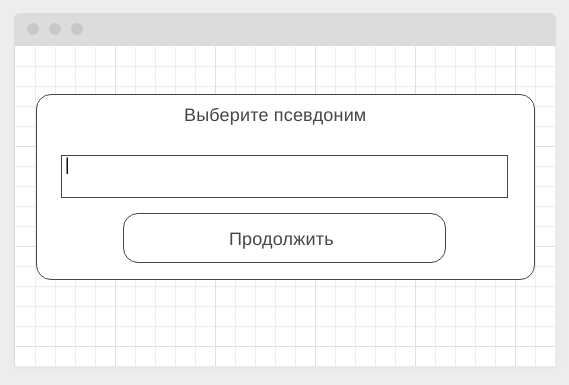

## [веб-сайт](https://a-naraikin.github.io/n-ahj-hw.-8_sse-ws_chat_frontend/)

## Домашняя работа «EventSource, Websockets: Chat»

Правила сдачи задания:

1. **Важно**: в рамках этого ДЗ можно использовать любой менеджер пакетов
2. Всё должно собираться через Webpack (включая картинки и стили) и выкладываться на Github Pages через Appveyor
3. В README.md должен быть размещён бейджик сборки и ссылка на Github Pages
4. В качестве результата присылайте проверяющему ссылки на ваши GitHub-проекты
5. Авто-тесты писать не требуется
6. Серверная часть должна быть выложена на Heroku

---

## Чат

### Легенда

В рамках реализации корпоративного портала вам поручили организовать чат, и, конечно же, вы решили для этого использовать веб-сокеты.

### Описание

Вам необходимо реализовать и серверную, и клиентскую часть. Серверную часть мы предлагаем вам реализовать на базе пакета ws, который был продемонстрирован на лекции.

При загрузке страницы появляется всплывающее окно, в котором запрашивается никнейм, под которым вы будете зарегистрированы в чате:

Если такой никнейм свободен, то открывается окно чата, в противном же случае вы должны сообщить пользователю о том, что никнейм занят и ему необходимо выбрать другой (продумайте, как вы реализуете это).

Общее окно чата:

Обратите внимание: сообщения всех участников чата (кроме ваших) выравниваются по левому краю, а ваши - по правому.

Важно: `You` - это не никнейм, это указатель на то, что это Вы.

Важная детально: при отключении пользователя он должен удаляться из списка пользователей в левой части.
